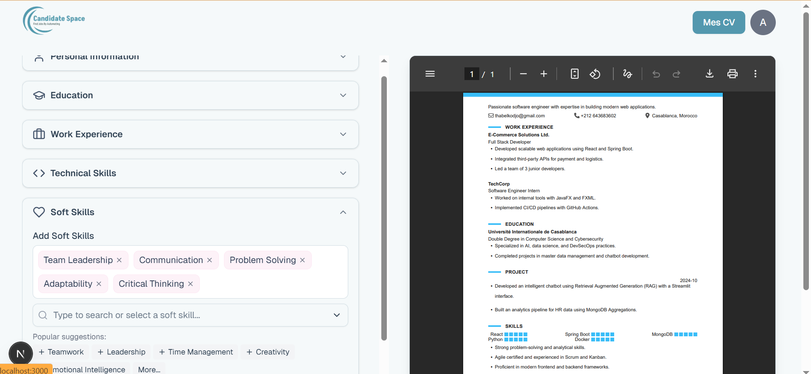

# Candidate Space Project

## Description
A modern web app designed to help users generate personalized CVs based on specific job offers. By leveraging AI, the app creates CVs that align closely with job requirements, improving a candidate’s chances of success.

## Why?
Many job seekers struggle to tailor their CVs to match each job offer. This project solves that problem by automating CV creation, saving time and ensuring relevance. The goal is to streamline the application process and empower users to present themselves more effectively to potential employers.

## Quick Start
1. Clone the repository:
    ```bash
    git clone https://github.com/thabel/candidatesapce.git
    ```

2. Install dependencies:
    ```bash
    cd candidatesapce
    npm install
    ```

3. Run the development server:
    ```bash
    npm run dev
    ```

4. Visit `http://localhost:3000` in your browser.

## Usage
- Upload or input the job offer text.
- Input your personal details and experience.
- Generate an AI-based tailored CV.
- Review and download the CV.

## Frameworks & Tools
- Next.js (React Framework)
- AI/LLM APIs (to generate content)
- React PDF
- Redux

## Screenshots

 

## Contributing
Contributions are welcome!  
Feel free to open an issue or submit a pull request.

1. Fork this repository.
2. Create a new branch: `git checkout -b feature/your-feature-name`.
3. Commit your changes: `git commit -m 'Add some feature'`.
4. Push to the branch: `git push origin feature/your-feature-name`.
5. Open a pull request.

